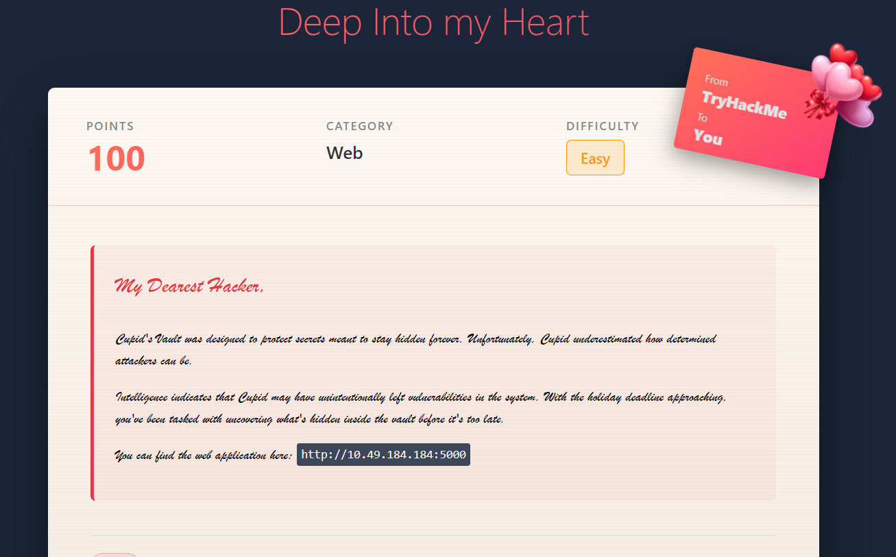
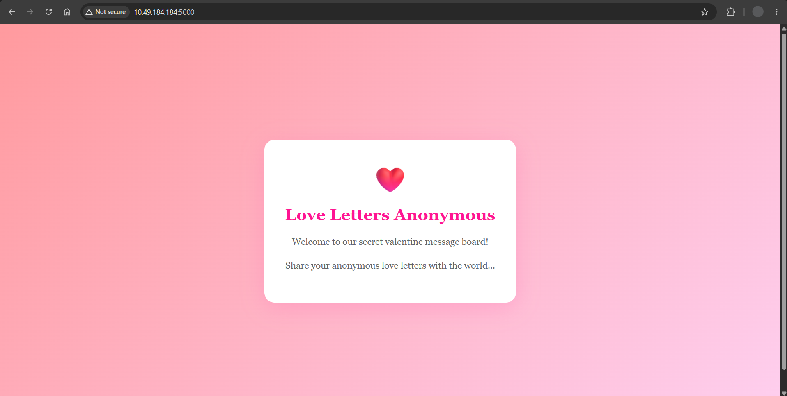
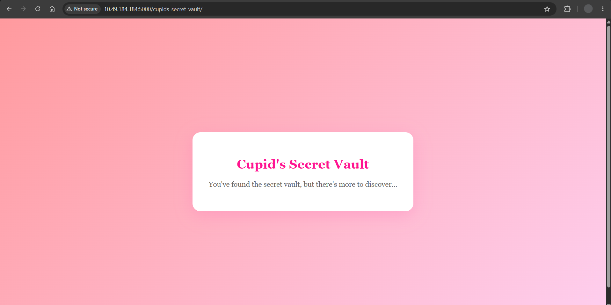
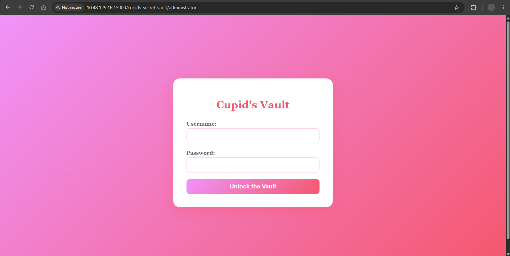
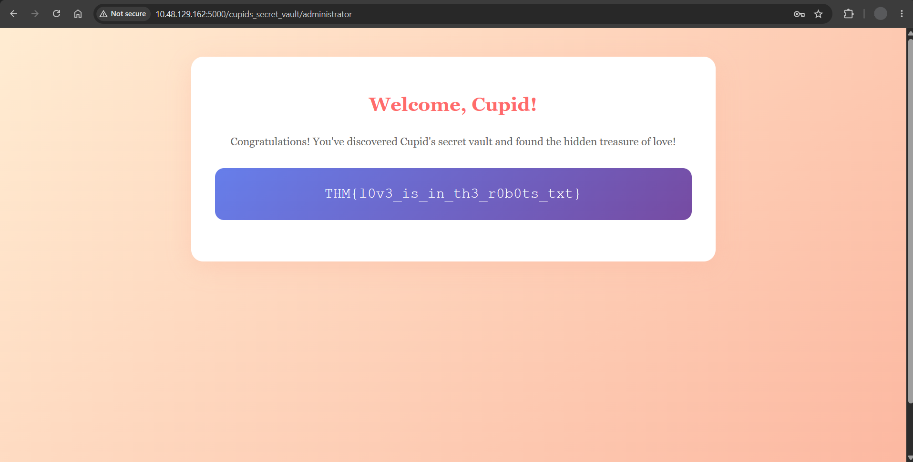

# Hidden Deep Into my Heart — CTF Writeup

**Platform:** TryHackMe  
**Room:** [Hidden Deep Into my Heart](https://tryhackme.com/room/lafb2026e9)  
**Category:** Web Exploitation  
**Difficulty:** Easy  
**Date:** 2026-10-06  

## Overview

A Valentine's-themed web exploitation challenge built around a fictional
"Cupid's Vault" meant to keep its secrets hidden. The credentials needed
to log into the admin panel were hidden in plain sight inside
`robots.txt`, rather than behind any brute-forcing or deep enumeration:
a reminder that recon should be exhausted before reaching for
brute-force tools.

**Final result:** Admin panel access using credentials disclosed in
`robots.txt`.



---

## 1. Reconnaissance

### Target

Web application hosted at:

```
http://10.48.129.162:5000
```

Opened in the browser: a standard landing page with nothing of note in
the rendered content or page source.



---

## 2. Enumeration

### robots.txt

```
http://10.48.129.162:5000/robots.txt
```

Contents:

```
User-agent: *
Disallow: /cupids_secret_vault/*

# cupid_arrow_2026!!!
```

Two things of note:
- A disallowed path, `/cupids_secret_vault/`, hinting at a hidden area.
- A comment string, `cupid_arrow_2026!!!`, sitting directly beneath it:
  which turned out to be the actual credential needed later, not just a
  decorative comment.

### /cupids_secret_vault/

```
http://10.48.129.162:5000/cupids_secret_vault/
```

Nothing interesting in the page source, but the visible text hinted
there was "more to discover."



### Directory enumeration

```
gobuster dir -u http://10.48.129.162:5000/cupids_secret_vault/ -w Desktop/CS/wordlist/wordlist.txt
```

```
/administrator        (Status: 200) [Size: 2381]
```

### /cupids_secret_vault/administrator

A login page.



Brute-forcing the `admin` username with Hydra was attempted here but
did not yield anything: a dead end that, in hindsight, wasn't
necessary.

---

## 3. Initial Access / Exploitation

Revisiting `robots.txt`, the string `cupid_arrow_2026!!!` looked less
like a comment and more like a credential. Tried it as the password for
username `admin` on the `/administrator` login page.

```
Username: admin
Password: cupid_arrow_2026!!!
```

Login succeeded.



**Flag:** `THM{l0v3_is_in_th3_r0b0ts_txt}`

---

## 4. Privilege Escalation

Not applicable: admin-level access was obtained directly via the
disclosed credentials; there was no further privilege boundary to
cross.

---

## 5. Root Cause

- Sensitive credentials were left as a plaintext comment inside a
  publicly accessible `robots.txt` file.
- `robots.txt` is intended only to guide search-engine crawlers and is
  never a mechanism for restricting access: any path listed in it
  (and any comment left alongside it) is visible to anyone.

## 6. Remediation

- Never store credentials, secrets, or sensitive comments in
  `robots.txt` or any other publicly served file.
- Treat `Disallow` entries as a map for attackers, not a security
  control: pair any genuinely sensitive path with real
  authentication/authorization, not just exclusion from crawling.
- Enforce credential rotation and secrets scanning across
  publicly-served static files as part of routine hygiene.

---

## Lessons Learned

Sometimes the solution is hidden in information already provided:
this challenge was solvable without brute-forcing or deep directory
enumeration. Always fully review easily accessible files
(`robots.txt`, `sitemap.xml`, page source, HTTP headers) before
escalating to noisier techniques.

---

## Tools Used

`gobuster`, `hydra`, browser dev tools
